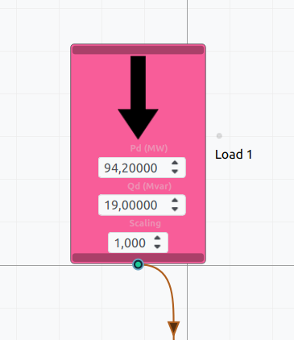
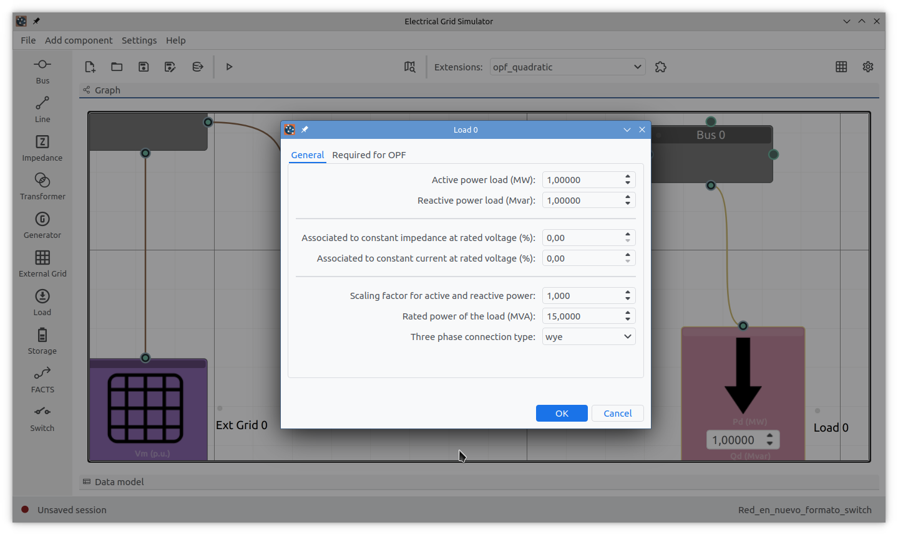
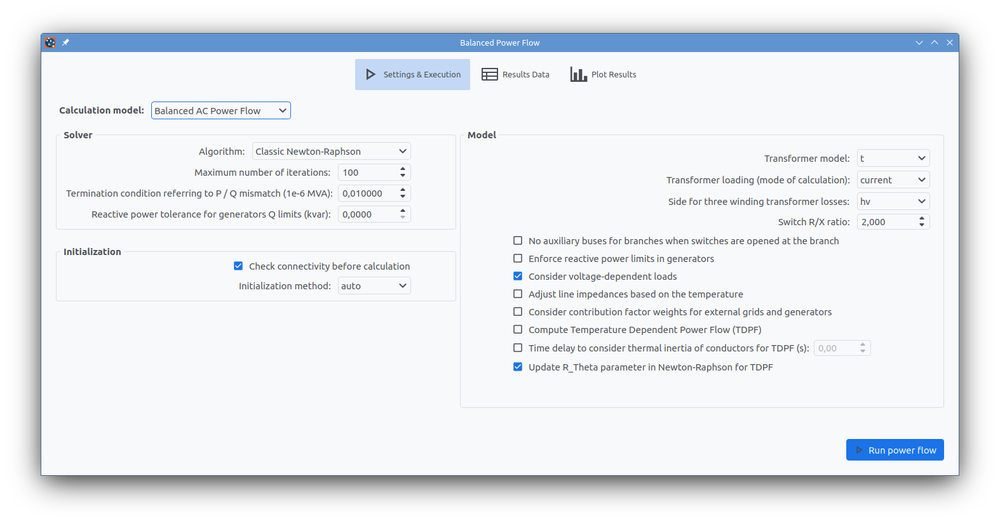
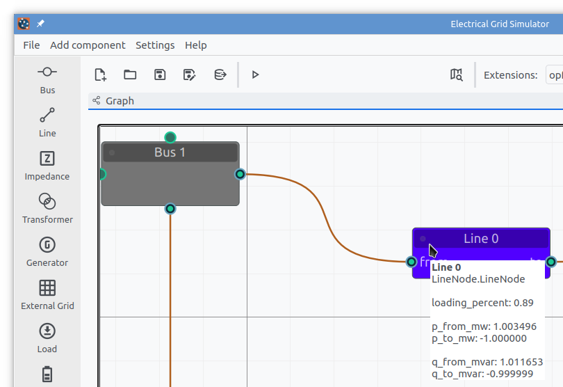
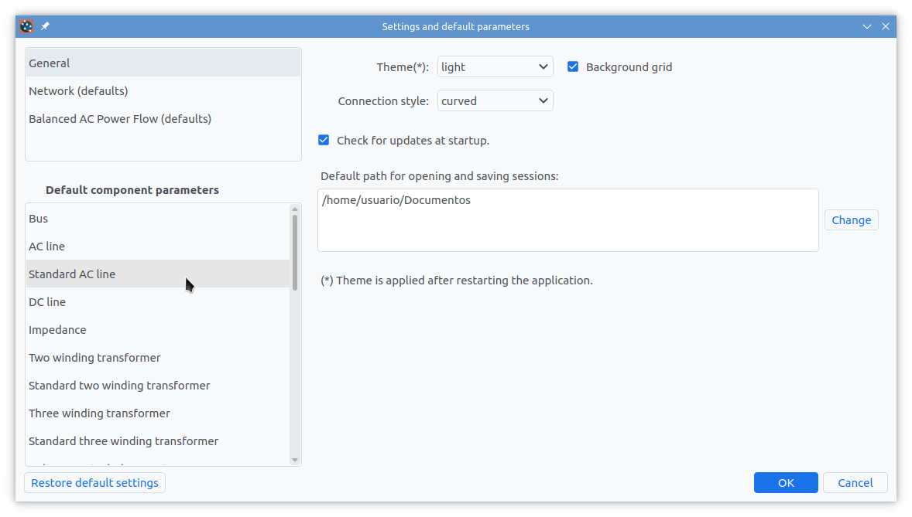
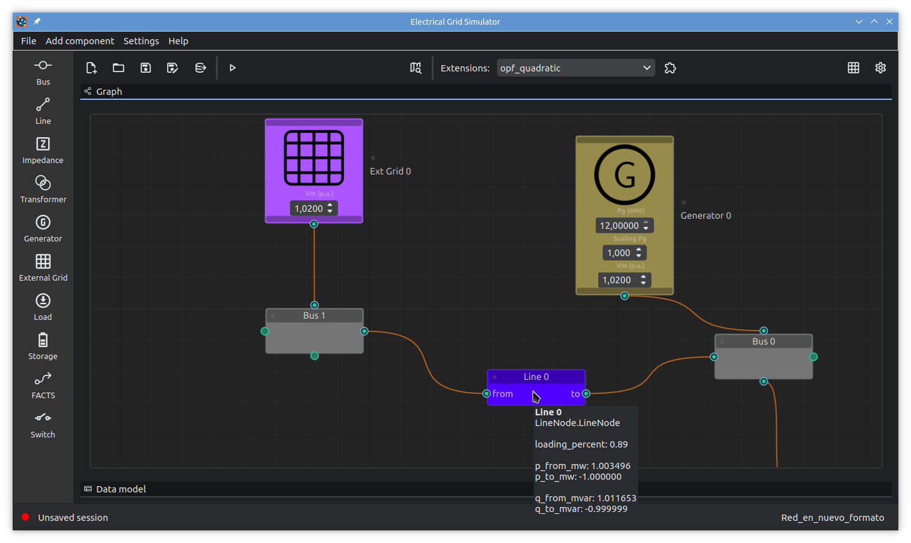
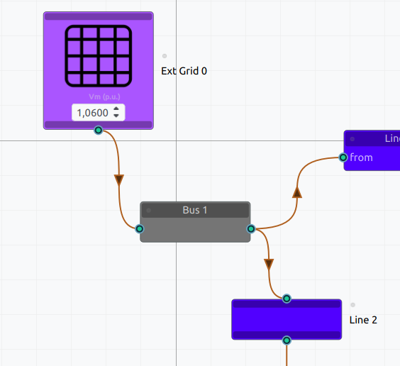
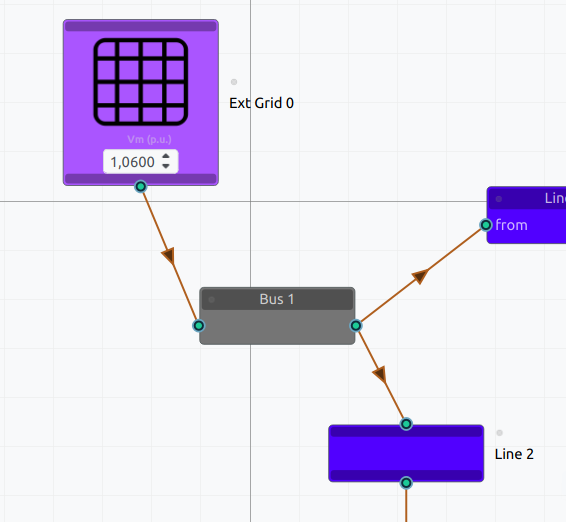
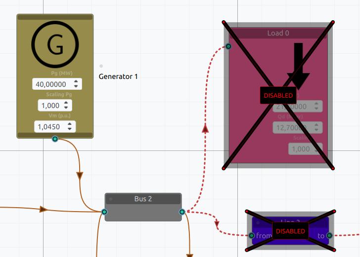
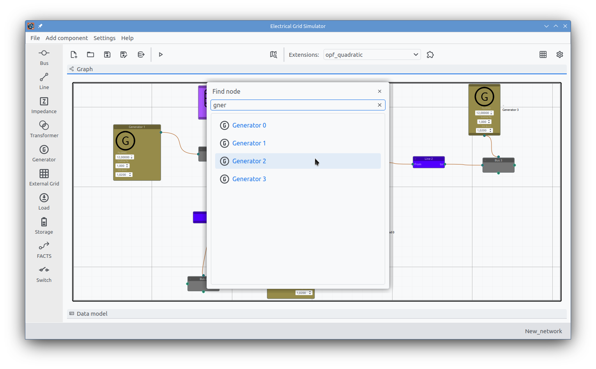

# Electrical Grid Simulator (EGS)
The *Electrical Grid Simulator* (abbreviated as **EGS**) is a graphical user interface application for simulating electrical networks based on the [pandapower](https://www.pandapower.org/) library. The main objective is to allow the creation of mathematical models for steady-state electrical grids from a user-friendly interface. It adds an extensions system for including new calculation or simulation algorithms. Extensions are implemented as standard Python packages, so they can be distributed through the [PyPI repository](https://pypi.org/).

<p align = "center">

</p>

EGS is developed at the *National Technological University, Santa Fe Regional Faculty* ([UTN-FRSF](https://www.frsf.utn.edu.ar/)), at the *Center for Research and Development in Electrical Engineering and Energy Systems* ([CIESE](https://www.frsf.utn.edu.ar/investigacion-y-vinculacion/investigacion-y-vinculacion/centros-y-grupos/ciese)), Argentina.

<p align = "center">

</p>


> [!WARNING]  
> This application is in an early stage of development. So you can expect incomplete sections and some (or many) bugs. New changes may cause incompatibilities with older versions (old files that no longer work with newer versions of the program).

## Goals
- Providing a minimalistic, modern and good-looking interface.
- Multiplatform: GNU/Linux, MS Windows and Apple MacOS (not tested on MacOS).
- Providing an extensions system to expand its capabilities **(starting in versión 0.0.6.9)**.

## How it is built
EGS is built in Python and entirely from open source and free software. The main core components are:

* The [pandapower](https://www.pandapower.org/) modeling and calculation library for electrical power systems.
* The [Qt](https://www.qt.io/) toolkit with [PySide6](https://wiki.qt.io/Qt_for_Python) bindings for the UI.
* A `Qt6` port (fork) of the [NodeGraphQt](https://github.com/jchanvfx/NodeGraphQt) library for building the graph (schematic network graphic).
* The [PyQtDarkTheme](https://github.com/5yutan5/PyQtDarkTheme) package for applying modern themes (light and dark themes).
* The [QtAwesome](https://github.com/spyder-ide/qtawesome) package for modern flat monochromatic icons.
* The [matplotlib](https://matplotlib.org/) package for plotting calculation results.
* Other scientific Python packages, mainly [NumPy](https://numpy.org/) and [pandas](https://pandas.pydata.org/).


EGS is implemented as a Python package uploaded to the [PyPI repository](https://pypi.org/). ```pandapower``` and other packages listed above are set as dependencies.

> [!NOTE]  
> Starting with version **0.0.8.0**, the EGS package includes a fork of `NodeGraphQt` ported to `Qt6` (using the `PySide6` library). This implementation is renamed to `NodeGraphQt6` in order to avoid conflicts. These changes allow the application to run on recent versions of Python.


## How it works
Every time the user inserts and connects an element to the grid, the application replicates the addition in a ```pandapower``` network. Thus, the parameters of a component are updated in the ```pandapower``` network when they are modified from the graphical interface.

The network configured from the interface is designated as **Graph**, while the corresponding ```pandapower``` model is denoted as **Data model**. This synchronization works in the **Graph -> Data model** direction, i.e. changes in the **Graph** are automatically registered into the **Data model**, and not the other way around. However, the contents of the **Data model** can be consulted at any time. 

According to the structure proposed by the ```pandapower``` library, the **Data model** consists of a set of tables ([pandas DataFrame type objects](https://en.wikipedia.org/wiki/Pandas_(software))). Each table (**DataFrame**) contains the parameters of a certain type of component. The types of components supported by ```pandapower``` are those indicated in [this documentation link](https://pandapower.readthedocs.io/en/latest/elements.html). At this moment, most of these components are also supported by EGS.


<p align = "center">
<i>Main window: Graph view</i>
</p>


<p align = "center">
<i>Extension manager: Select and execute extensions</i>
</p>


<p align = "center">
<i>Main window: Data model view - Tables arranged in tabs</i>
</p>
</br></br>

The EGS main window is organized as follows:

*  The main work area can display either the **Graph** or the **Data model**. The **Data model** is shown as a set of tables arranged in tabs. For more information about this data (including the meaning of column names), see the [pandapower documentation](https://pandapower.readthedocs.io/).
* The left side toolbar lists the supported components. An element is added to the **Graph** by clicking on the corresponding icon. In some cases, an icon may represent a category (e.g., loads).  In such cases, a dialog allows you to choose the required type within that category. For example, in the loads category, six different types are available.
Switches work in a different way. According to ```pandapower```, switches can be added between two buses or between a bus and a line (AC line) or transformer. Thus, if you want to do the first, just select two buses and then click the switch button. On the contrary, if you want to add a switch next to a line (or transformer), select only the corresponding element and then click the switch button. In this case, a new dialog will allow you to select the bus.
* The upper toolbar is divided into three parts. The left part contains the file functions and the calculation options. Here it is possible to open/save files, export only the **Data model** to JSON, or simply delete the network and start a new one. The *"play"* button opens the dialog for a power flow calculation. Meanwhile, the right side gives access to the basic network configuration (name, base system power and rated frequency) and to the application settings dialog. The fuzzy search launcher and the extension manager are displayed at the center. In order to run an extension, just select one of them and click the run button.
* The status bar at the bottom will notify when the grid has been modified and has not been saved.
* The menu bar includes most of the options available in the toolbars.

## Main features

### Nodes and ports
A **node** element is a component added to the **Graph**. A **node** should not be mistaken for a network **bus**. Any component of the grid is represented by a **node** in the **Graph**. For this reason, there is a *node type* for each type of component supported by EGS.

<p align = "center">

</p>
<p align = "center">
<i>Node element (example: symmetric load with an output port)</i>
</p>
</br></br>

Some nodes provide widgets that work as shortcuts for some of their main features. For example, a symmetric load node has three widgets (as shown above) to set the real and reactive power demands, and a scale factor. However, all the node parameters are accessed from a dialog after double clicking on the node, as shown below. Additionally, the node name can be modified after double clicking on it.


<p align = "center">
<i>Node dialog (example for a symmetric load node)</i>
</p>
</br></br>

Node types (component types) are distinguished by color. For example, a line is represented by a different color than the one used for a transformer. Two- and three-winding transformers have nodes with the same color, but differs in the number of connections. Additionally, most of the nodes present a symbol (icon) identifying the type of component.

Nodes can have input and output ports. Connections are made by linking an output port on one node with an input port on another node. For example, to connect a generator to a bus, you can link the output port of the generator to the input port of the bus.

When a node is displayed in horizontal layout, input ports are placed on the left and output ports on the right. In the vertical layout, input ports are placed at the top and output ports at the bottom. For convenience, nodes with a single port can be flipped, so that an input port becomes an output port, or vice versa. Additionally, buses are represented since version 0.0.8.4 with four-port nodes, which means that one output port is placed on the right and one at the bottom, and similar locations are available for two input ports (left and top).

The distinction between input and output ports has another use in certain components. For example, in a two-winding transformer, the input port represents the *high voltage side* (hv), while the output port corresponds to the *low voltage side* (lv). In this case, to make it easier to distinguish, these ports have different shapes. In an AC line, input and output ports refer to the *"from bus"* and *"to bus"* sides, respectively. On the contrary, there is no distinction between input and output ports in a bus, which correspond to the same point.

<p align = "center">

</p>
<p align = "center">
<i>Two-winding transformer and AC line nodes</i>
</p>
</br></br>

When a bus node is added to the **Graph**, it is immediately inserted also into the **Data model**. But this is not the case with other components, which are included in the **Data model** only when they are connected. This behavior is due to the fact that ```pandapower``` requires the connection points to insert a new element into the grid (with the only exception of the bus component). But this has an advantage: you can disconnect an element and connect it again in a different place, without losing the parameters configured in the node, which remain stored in the **Graph**. EGS will take care of maintaining the synchronization with the **Data model**.

### Simulations and calculations
With EGS you can build and set up the model of an electrical grid in a graphical way. The application also allows you to perform *AC balanced power flow* calculations (other calculations supported by ```pandapower``` may be added in the future). For other types of simulations and calculations, you can proceed according to two alternatives:

1. Export the **Data model** and the last power flow results to a JSON format file ready to be imported from a Python script through ```pandapower```. Then, any calculation or processing can be done from the script. The export is done from the graphical interface, while the subsequent import is done as indicated [in the pandapower documentation](https://pandapower.readthedocs.io/en/latest/file_io.html#pandapower.from_json), using the ```pandapower.from_json()``` function.

2. Incorporate the required calculation functionality from an extension developed in Python. This way, the calculation is executed from within EGS. Extensions are implemented as regular Python packages. An Optimal Power Flow (OPF) extension is available in the PyPI repository (package name: **electricalsim-opf-quadratic**). **Instructions and a template for creating extensions will be available soon.**

Models generated by EGS can be saved in a file containing both the **Graph** and the **Data model** (**.egs** file extension). You can then reopen the file whenever you need it and retrieve even the results of the last power flow run.


### Running an AC balanced power flow
In order to run a power flow, click on the ***play*** button at the upper toolbar. A new dialog gets opened. The first tab allows you to configure the parameters of the numerical method (solver) and other model settings. Then, execute the calculation using the ***Run power flow*** button.


<p align = "center">
<i>Power flow dialog - First tab (settings)</i>
</p>
</br>

The sencond tab shows the results in the ```pandapower``` way (tables), while the third tab includes some plots:

* Voltage magnitudes.
* Voltage box plot.
* Voltage magnitudes at load buses.
* AC line loading (percentage rate).
* AC line voltages.
* Two- and three-winding transformer loading.
* Reactive power on PV buses (voltage controled generators).

In bar voltage charts, the magnitud level is distinguished with different colors to emphasize acceptable values, under-voltages and over-voltages. Line and transformer overloads are also highlighted in red. In addition, the head of the plot usually includes some statistical results.


<p align = "center">
<i>Power flow dialog - Second tab (pandapower results)</i>
</p>
</br>


<p align = "center">
<i>Power flow dialog - Third tab (plot results) - Voltages</i>
</p>
</br>


<p align = "center">
<i>Power flow dialog - Third tab (plot results) - AC line loading</i>
</p>
</br>

After closing the power flow dialog and returning to the *graph view*, you can place the cursor on a particular node and get a tooltip with the main results (see the screenshot below). For example, an AC line shows the loading percentage, and the real and reactive power transmitted (at the *"from bus"* and *"to bus"*). Most of the nodes show this kind of information.


<p align = "center">
<i>Tooltip - Power flow results</i>
</p>
</br>

### Application settings

The application settings are saved in a ```config.ini``` file outside the installation directory. This way, your settings are maintained after updating the program. However, you can change them from a dialog window.

Settings are classified into four categories:

* **General:** Includes the theme, the background grid visibility, the connection style and a default working directory.

* **Network:** Defaults grid name, power system base and rated frequency.

* **Power flow**: Mainly the default settings for the power flow solver.

* **Default component parameters:** The defaults settings for every node type.


<p align = "center">
<i>Settings dialog</i>
</p>
</br>


<p align = "center">
<i>EGS with dark theme</i>
</p>
</br>

<p align = "center">



</p>
<p align = "center">
<i>Connection style: angle, curved and straight</i>
</p>
</br></br>

### Shortcuts

| Shortcut | Description |
| -------- | ----------- |
| ```Ctrl+N``` | Create a new session |
| ```Ctrl+O``` | Open session from a **.egs** file |
| ```Ctrl+S``` | Save session to a **.egs** file |
| ```Ctrl+Shift+S``` | Save session as... |
| ```Ctrl+E``` | Export **Data model** to a JSON file |
| ```Ctrl+Z``` | Undo |
| ```Ctrl+Shift+Z``` | Redo |
| ```Del``` | Delete selected components in the **Graph** |
| ```Ctrl+A``` | Select all the nodes in the **Graph** |
| ```Ctrl+Shift+A``` | Unselect what is selected |
| ```D``` | Disable the selected nodes |
| ```R``` | Flip the selected nodes (works only with nodes that have only one port) |
| ```Ctrl+D``` | Duplicate the selected nodes (switches cannot be duplicated) |
| ```Ctrl++``` | Zoom in |
| ```Ctrl+-``` | Zoom out |
| ```=``` | Reset zoom |
| ```F``` | Adjust the zoom level according to the selection |
| ```V``` | Change selected nodes to the vertical layout |
| ```H``` | Change selected nodes to the horizontal layout |
| ```Shift+V``` | Apply a vertical alignment to selected nodes |
| ```Shift+H``` | Apply a horizontal alignment to selected nodes |
| ```Ctrl+F``` | Find a node by fuzzy search |

> __Note__ <br>
> * ```Undo``` and ```Redo``` only work for simple actions.
> * Pressing ```F``` without selected nodes will adjust the zoom level to show all the grid.
> * Pressing ```D``` will change the bool value for the ```in_service``` parameter in the **Data model**. This works for every component, except for switches.
> * For selecting nodes in the **Graph** you can use the left mouse button (```LMB```). Just click with the ```LMB```, hold and drag to mark the selection area.
> * Clicking with the ```LMB``` on the background will unselect all.
> * You can use ```Shift+LMB``` on a node in order to add it to the selection.
> * ```Ctrl+LMB``` or ```Shift+LMB``` on a selected node will unselect it.
> * The mouse scroll wheel can be used to zoom in and out.
> * Use the medium mouse button (```MMB```) to scroll over the **Graph**. Just click with the ```MMB```, hold and move.
> * Hold ```Shift+Alt+LMB``` to slice several connections (see the picture below).

If you prefer to use the mouse instead of keyboard shortcuts, just right click on the **Graph** and access a context menu that complements the upper toolbar and the menu bar.

<p align = "center">

<p align = "center">
<i>Disabling nodes</i>
</p>
</br>

<p align = "center">

<p align = "center">
<i>Slicing connections</i>
</p>
</br>

<p align = "center">

<p align = "center">
<i>Fuzzy search</i>
</p>
</br>


<p align = "center">
<i>Context menu</i>
</p>
</br>

# Installation
EGS is installed using ```pip```, the official Python package manager.

On GNU/Linux and MacOS execute the following order in a terminal:
```bash
pip install electricalsim
```

On MS Windows you may prefer:
```bash
python -m pip install electricalsim
```

If you want to install the latest development version:
```bash
python -m pip install git+https://github.com/aloytag/electrical-grid-simulator.git -U
```

## Upgrading EGS
In order to upgrade EGS via ```pip```, execute the following in a terminal:

```bash
pip install electricalsim -U
```
On MS Windows you may prefer:
```bash
python -m pip install electricalsim -U
```

## Running EGS
Once installed, you can run it with the command:

```bash
egs
```

If you prefer to run the program in a more practical way, just execute this command only once:

```bash
egs-create-shortcut
```

This will add a shortcut launcher to your desktop and to your application menu. Note that this launcher will not work if you are installing the application into a Python virtual environment.


## Uninstalling
If you want to remove the application, execute:

```bash
pip uninstall electricalsim
```

On MS Windows:
```bash
python -m pip uninstall electricalsim
```

Note that shortcuts added with the ```egs-create-shortcut``` command are not removed. So you must delete them manually.

## Installing extensions

Extensions available in the PyPI repository can be installed using ```pip```. For example, the [Optimal Power Flow extension](https://github.com/aloytag/electricalsim-opf-quadratic) is installed with:

```bash
pip install electricalsim-opf-quadratic
```

On MS Windows:
```bash
python -m pip install electricalsim-opf-quadratic
```

# License

This project uses the [MIT license](https://github.com/aloytag/electrical-grid-simulator/blob/main/LICENSE).

The background image on the splash screen is based on the work of [David Gunter](https://www.flickr.com/photos/23812004@N03/6637323071), marked with a [CC BY 2.0](https://creativecommons.org/licenses/by/2.0/) license.
